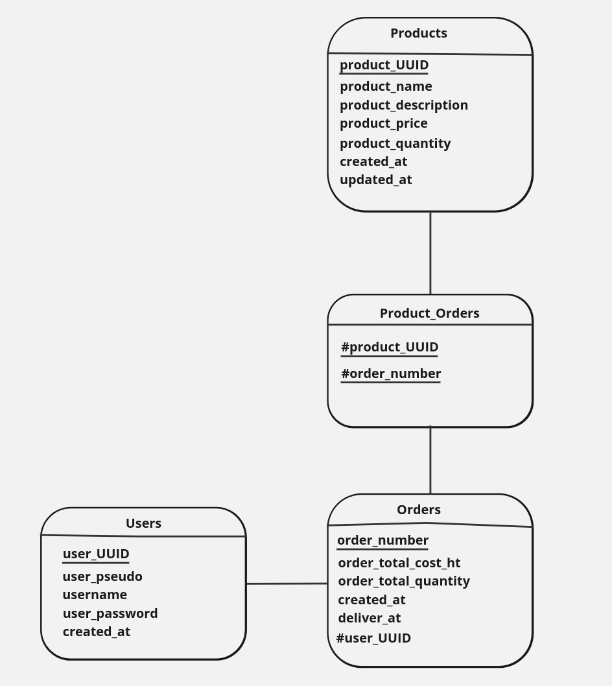

# Propositions d'amélioration du MLD

### 1. Retrait des Cardinalités
Les cardinalités entre les tables actuelles peuvent être supprimées.

### 2. Suppression des Relations
Les relations comme "Is ordered by" peuvent être retirées.

### 3. Correction du Nom de l'Entité-Association entre `Products` et `Orders`
Une correction du nom de la table-association entre `Products` et `Orders` est nécessaire pour assurer une meilleure compréhension des données et une cohérence dans la dénomination des relations.

# Proposition d'amélioration de la base de données

## 1. Ajout d'une Table `ADMIN`

Actuellement, la table `USERS` ne permet de distinguer aucun type spécifique d’utilisateur. En ajoutant une table `ADMIN`, il serait possible de gérer les informations et privilèges particuliers des administrateurs du système, qui ont des responsabilités accrues en termes de configuration et de gestion des utilisateurs et des commandes. Cette table pourrait contenir les attributs suivants :

- `admin_id` : Identifiant unique pour chaque administrateur.
- `user_UUID` : Clé étrangère référencée dans `USERS` pour associer les informations d’un administrateur à son profil utilisateur général.
- `admin_level` : Niveau d’autorité, pour distinguer différents niveaux d’administrateurs, si nécessaire.
- `permissions_scope` : Champ pour préciser les zones d’accès spécifiques pour chaque administrateur, afin de mieux contrôler les actions autorisées dans le système.

## 2. Ajout d'une Table `MANAGER`

De même, une table `MANAGER` permettrait de stocker des informations spécifiques aux utilisateurs ayant un rôle de gestionnaire, par exemple pour superviser les stocks ou gérer certaines commandes. Cette table serait liée à `USERS` et pourrait inclure :

- `manager_id` : Identifiant unique pour chaque manager.
- `user_UUID` : Clé étrangère référencée dans `USERS` pour associer chaque manager à son profil utilisateur.
- `department` : Département ou zone de gestion, permettant de spécifier les domaines dont chaque manager est responsable (ex. : gestion des stocks, support client).
- `supervised_orders` : Champ pour indiquer si le manager peut superviser les commandes ou les produits d’une certaine catégorie.

## 3. Optimisation de la Gestion des Commandes et Produits

- **Historique des Prix (`PRICE_HISTORY`)** : Pour assurer une traçabilité des prix des produits, une table `PRICE_HISTORY` pourrait enregistrer les changements de prix au fil du temps. Elle inclurait les attributs suivants : `product_UUID`, `old_price`, `new_price`, et `changed_at` (date de modification). Cela permettrait de garder un historique des prix et d’éviter les incohérences lors des audits ou des analyses.
  
- **Suivi des Mouvements de Stock (`STOCK_MOVEMENTS`)** : Afin d’améliorer la gestion des stocks, une table `STOCK_MOVEMENTS` pourrait être introduite pour consigner chaque entrée et sortie de stock. Elle comprendrait des informations telles que `movement_id`, `product_UUID`, `movement_type` (entrée ou sortie), `quantity_changed`, et `movement_date`. Cette table permettrait de suivre avec précision les quantités en stock, de l’approvisionnement jusqu’à la vente, pour une meilleure gestion logistique.

---

